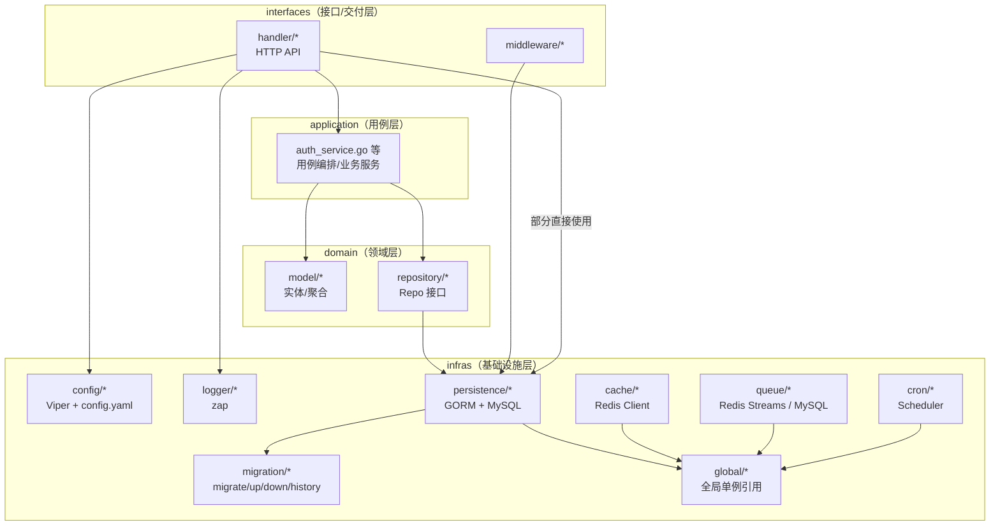
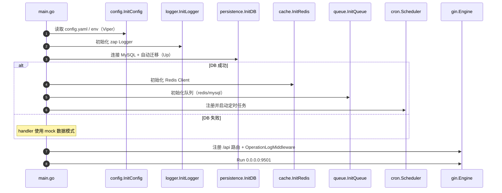

# 架构图（Mermaid）

> 说明：把本文件在支持 Mermaid 的 Markdown 预览器里打开即可看到图形（例如 GitLab/GitHub/多数 IDE 插件）。

## 1）系统整体组件图（前后端 + 基础设施）

```mermaid
flowchart LR
  %% Clients
  subgraph Clients[客户端]
    Browser[浏览器<br/>Vue3 SPA]
    Electron[Electron 桌面壳<br/>加载 Vite Dev / dist]
  end

  %% Frontend
  subgraph FE[前端（web/）]
    ViteDev[Vite DevServer :5173<br/>Proxy /api -> :9501]
    Dist[dist 静态资源]
    Axios[Axios<br/>baseURL=/api<br/>Authorization=token]
  end

  %% Backend
  subgraph BE[后端（Go / Gin）]
    Gin[Gin HTTP Server<br/>main.go]
    Routes[/api 路由组]
    MW[Middleware<br/>OperationLog]
    Handlers[Handlers<br/>User/Role/Permission/Menu/Path/Auth/...]
    App[Application Services<br/>AuthService]
    Domain[Domain<br/>Models + Repo Interface]
    Infras[Infras<br/>Config/Logger/Persistence/Cache/Queue/Cron/Migration]
  end

  %% Infra services
  subgraph Infra[外部依赖]
    MySQL[(MySQL)]
    Redis[(Redis)]
    Q[(Queue<br/>Redis Streams / MySQL)]
  end

  %% Flows
  Browser -->|HTTP(S)| ViteDev
  Electron --> ViteDev
  Electron -->|生产模式| Dist
  ViteDev --> Axios
  Dist --> Axios
  Axios -->|/api/*| Gin

  Gin --> Routes --> MW --> Handlers
  Handlers --> App --> Domain
  Handlers -->|部分 CRUD 直连| Infras
  Infras --> MySQL
  Infras --> Redis
  Infras --> Q
  MW -->|写操作落库| MySQL
```

## 2）后端分层（Clean/DDD 风格）



## 3）后端启动时序（main.go）



